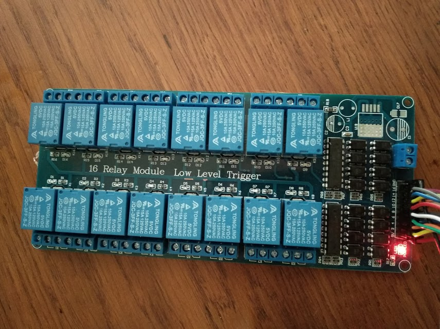

# OrangePI_RelaySwitch
Power Switching using 1-16 Relays and OrangePI (all OrangePI variations should work)
Hardware Requirements:
* Buy OrangePI2 Lite https://www.ebay.co.uk/itm/Orange-Pi-Lite-with-Quad-Core-1-2GHz-512MB-DDR3-WiFi-Mini-PC-Mali400MP2-GPU/272887180399?hash=item3f8957ec6f:g:~4cAAOSwS0lZ4ePd
* Buy 16 Relay Switch https://www.ebay.co.uk/itm/1-2-4-6-8-5V-Channel-Relay-Board-Module-Optocoupler-LED-for-Arduino-PiC-ARM-AVR-/273141723460?var=&hash=item3f9883f144

Software Requirements:
* Armbian

 


# Prepare OrangePI
You need to have Armbian or compatible Linux distribution on your OrangePI, then you need to connect GPIO ports from Relay to you OrangePI, here is the scheme how to do this:


# Install GPIO Support library (designed especially for OrangePI)
```
apt install python-setuptools python-pip python-dev
pip install python-daemon bottle pyA20
git clone https://github.com/duxingkei33/orangepi_PC_gpio_pyH3
cd orangepi_PC_gpio_pyH3
sudo python setup.py install
```

# Install the relay switching daemon and it's dependencies
```
wget https://raw.githubusercontent.com/e1z0/OrangePI_RelaySwitch/master/relay_switch -O /usr/local/bin/relay_switch
wget https://raw.githubusercontent.com/e1z0/OrangePI_RelaySwitch/master/relayswitch.service -O /etc/systemd/system/relayswitch
chmod +x /usr/local/bin/relay_switch
systemctl daemon-reload
systemctl enable relayswitch
systemctl start relayswitch
```
Also you can use /usr/local/bin/relay_switch for external commands, it supports powering and disabling the GPIO pinouts, turn on or off all the relays and display them all.

You can also specify their names... Run command
```/usr/local/bin/relay_switch --ports``` to show all the ports, copy them to the /etc/mods/settings file and make names for them for example i have this list:
```GPIO_199=monitorius 1
GPIO_198=stalas
GPIO_201=taburete
GPIO_20=kazkokia rozete
GPIO_10=grindinis sildymas
GPIO_9=pecius
GPIO_200=staline lempa
GPIO_8=tulikos sviesa
GPIO_7=ceinykas
GPIO_2=virykle
GPIO_71=lauko sviesa
GPIO_68=veranda
GPIO_3=skladukas
GPIO_0=balkonas
GPIO_1=virtuves sviesa
GPIO_110=testas
```
It will be read each time the app will request the list of the devices
